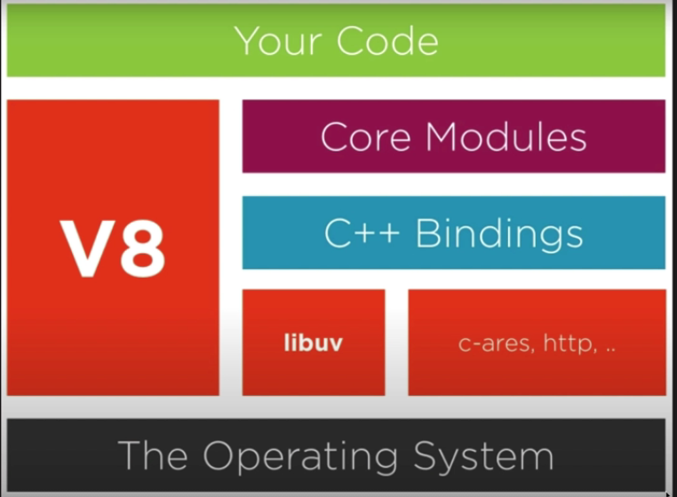

# V8

* Interpretador de JS para linguagem de máquina
* Criado em c++
* Baseado nas últimas features do JS
* focado para chrome mas tem todo o cuidado para não quebrar o node
* Não possui a DOM, console ou File System
* Resumo: V8 pega uma linguagem JS e converter para ficar mais perto da linguagem de máquina

